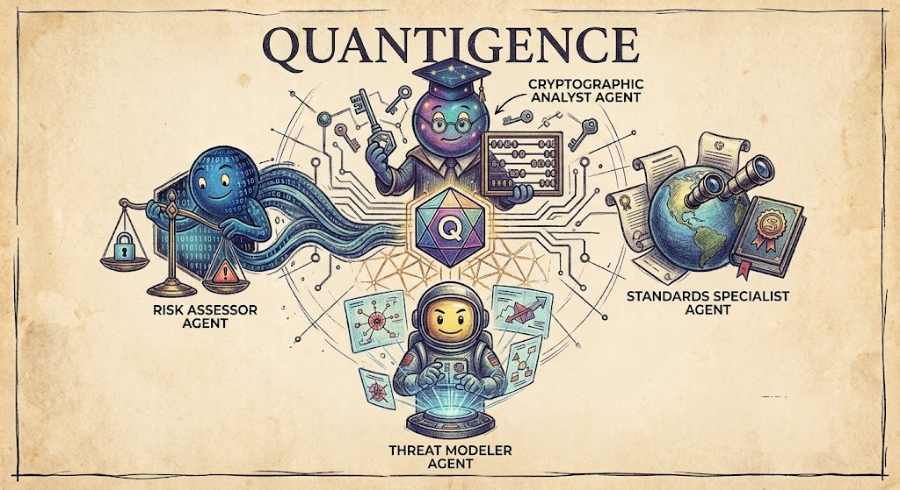

# Quantigence

<p align="center">
  
</p>

<p align="center">
  <a href="https://arxiv.org/abs/2512.12989"></a>
  <a href="LICENSE"></a>
  
  
</p>

A multi-agent framework for post-quantum cryptography (PQC) security analysis that
runs on a single commodity GPU. A supervisor agent decomposes a query and
dispatches it to four specialist agents (cryptographic analyst, threat modeler,
standards specialist, and risk assessor), each grounded in live tools: the arXiv
and NVD CVE APIs and a local BM25 index over the NIST PQC standards. The system
computes a **Quantum-Adjusted Risk Score (QARS)** to prioritize assets.

The repository has two parts: `code/` (the implementation, benchmark, evaluation
harnesses, and experiment results) and `paper/` (the LaTeX source and figures).
Everything needed to reproduce every number and figure is here.

> **Note on QARS.** The QARS name and its timeline/sensitivity/exposure
> decomposition are due to Grigaliūnas & Brūzgienė, *Towards a Unified Quantum
> Risk Assessment* (Electronics 2025, 14(17):3338). Our contribution is its
> automation: a continuous sigmoid urgency mapping and agent-driven parameter
> estimation from retrieved evidence.

## What's here

```
quantigence/          the framework
  qars.py             the risk score (pure functions + self-test)
  tools.py            arXiv + NVD clients (+ citation-existence checks)
  corpus.py           NIST PDF download, chunking, BM25 retrieval
  registry.py         tool schemas, dispatch, and the three poisoning defenses
  personas.py         the five agent system prompts
  llm.py              thin transport to a local llama-server
  orchestrator.py     the plan/dispatch/review loop and the 3 eval conditions
bench/                40-query benchmark + poisoning corpus
eval/                 scorer, harness, robustness experiment
scripts/              model download, serving, figure generation
```

## Setup

Requires Python 3.11+ and a CUDA GPU. Uses [`uv`](https://docs.astral.sh/uv/).

```bash
cd code
uv sync            # creates .venv and installs the exact locked versions
```

**Build llama.cpp** (pinned to tag `b10280`, built against CUDA 13 for the
Turing-class GPU used in the paper; adjust `CMAKE_CUDA_ARCHITECTURES` for your
card):

```bash
git clone --depth 1 --branch b10280 https://github.com/ggml-org/llama.cpp vendor/llama.cpp
cmake -S vendor/llama.cpp -B vendor/llama.cpp/build \
  -DGGML_CUDA=ON -DCMAKE_CUDA_ARCHITECTURES=75 -DLLAMA_CURL=OFF -DCMAKE_BUILD_TYPE=Release
cmake --build vendor/llama.cpp/build --target llama-server -j
```

**Download the model and start the server:**

```bash
.venv/bin/python scripts/download_models.py primary          # Qwen3.5-9B Q4_K_M (~5.7 GB)
bash scripts/serve.sh models/Qwen3.5-9B-Q4_K_M.gguf 8080 8192 99
```

## Reproduce the experiments

```bash
# atomic ablation (3 conditions x 40 single-fact queries)
.venv/bin/python -m eval.harness --conditions zeroshot,single_agent,quantigence \
    --model-tag qwen3.5-9b --out results/main

# complex-task eval (coverage + independent-judge quality); judge on a 2nd server
.venv/bin/python -m eval.complex_eval --conditions zeroshot,single_agent,quantigence \
    --base-url http://127.0.0.1:8080/v1 --judge-url http://127.0.0.1:8081/v1 \
    --out results/complex

# poisoning robustness (retrieval + generation conditions)
.venv/bin/python -m eval.robustness --out results/robustness

# model-scale study over the full benchmark (serve each model in turn)
.venv/bin/python -m eval.harness --conditions quantigence \
    --model-tag qwen3.5-4b --out results/scale
.venv/bin/python -m eval.harness --conditions quantigence \
    --model-tag qwen3-14b  --out results/scale
bash scripts/measure_vram.sh 0 && .venv/bin/python scripts/finalize_scale.py

# regenerate all figures (into paper/figures/) and the paper's numbers (paper/macros.tex)
for f in fig_qars fig_results fig_complex fig_robustness fig_scale make_macros; do
    .venv/bin/python scripts/$f.py; done
```

The harness is resumable: each `(condition, query)` result is a separate JSON
file, so an interrupted run continues where it left off.

## Headline results (Qwen3.5-9B, 4-bit, ~5.7 GB VRAM)

| Benchmark | Zero-shot | Single agent + tools | Quantigence |
|---|---|---|---|
| Atomic accuracy (40 Q) | 57% | **98%** | 95% |
| Complex-task coverage (10 Q) | 76% | 78% | **89%** |
| Avg. latency / query | 8 s | 6 s | 60 to 120 s |

Tools drive accuracy on atomic lookups, where multi-agent decomposition adds no
benefit at roughly 10x the latency. On complex, multi-faceted queries the
decomposition covers more of each task. Poisoning demotes cleanly under the
source-hierarchy defense (2.25 down to 0.75 poison chunks in the top-5), and the
grounded system adopts an injected false claim in only 12% of cases.

## Tests

Every module has a runnable self-check:

```bash
.venv/bin/python quantigence/qars.py         # risk-score math
.venv/bin/python quantigence/tools.py        # live arXiv + NVD
.venv/bin/python quantigence/corpus.py       # NIST download + BM25 + poison retrieval
.venv/bin/python -m quantigence.registry     # dispatch + defenses
.venv/bin/python -m eval.score               # scoring + citation validity
```

## License

Apache-2.0. See `LICENSE`. Model weights and the NIST PDF corpus are not
redistributed here; the scripts download them from their original sources.
